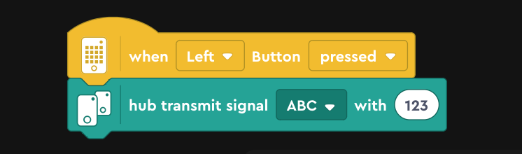
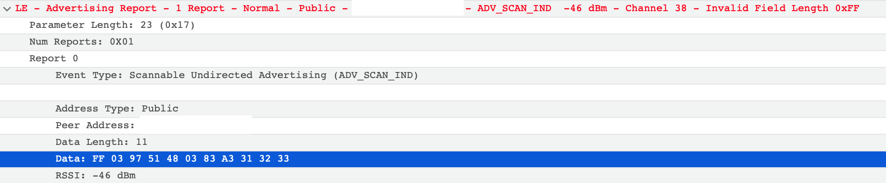

# LEGO MINDSTORMS Robot Inventor's Hub to Hub Communication Hacks

LEGO MINDSTORMS Robot Inventor's Hub to Hub Communication is implemented on Bluetooth LE (BLE) Advertising.

For example, when a hub transmits a signal `"ABC"` with a value `"123"`, some **INVALID** advertising packets will be sent as follows:




## Data structure

`FF 03 97 01 48 03 83 A3 31 32 33`

| Bytes | Meaning | Note |
| --- | --- | --- |
| `FF 03 97` | Fixed header | |
| `01` | Transmission ID (`0x00` - `0xff`) | MUST be changed for each transmission |
| `48 03 83 A3` | Signal name hash = CRC32(`"ABC"`) = `0xA3830348` | |
| `31 32 33` | Value = `"123"`  | Max 23 bytes |

## How to transmit a signal by hcitool

```
$ hcitool -i hci0 cmd 0x08 0x0006 a0 00 a0 00 02 00 00 00 00 00 00 00 00 07 00
$ hcitool -i hci0 cmd 0x08 0x0008 0b ff 03 97 01 48 03 83 a3 31 32 33
$ hcitool -i hci0 cmd 0x08 0x000a 01
...
$ hcitool -i hci0 cmd 0x08 0x000a 00
```

## Demo: Transmit signals from Raspberry Pi

https://www.youtube.com/watch?v=K0kwiPHDSnw
- Transmitter: Raspberry Pi Zero W
  - Python 3.7+ scrpit: [transmitter.py](raspberry-pi/transmitter.py) using [hub2hub.py](raspberry-pi/hub2hub.py)
  - Transmit signals with a counter value when pushing the button like [this word block program](Images/transmit-counter-block.png)
- Receiver: MINDSTORMS Hub
  - 

